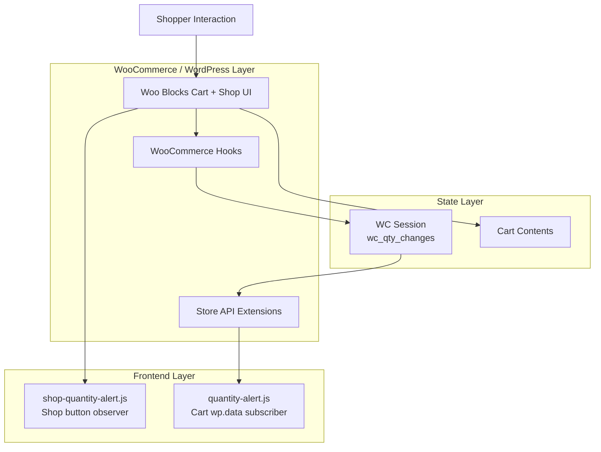
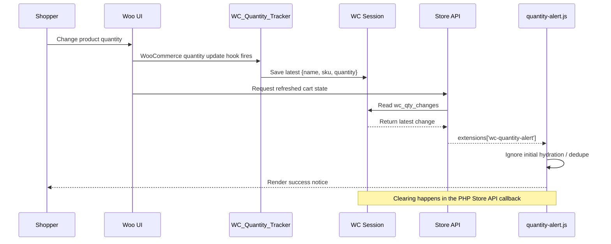
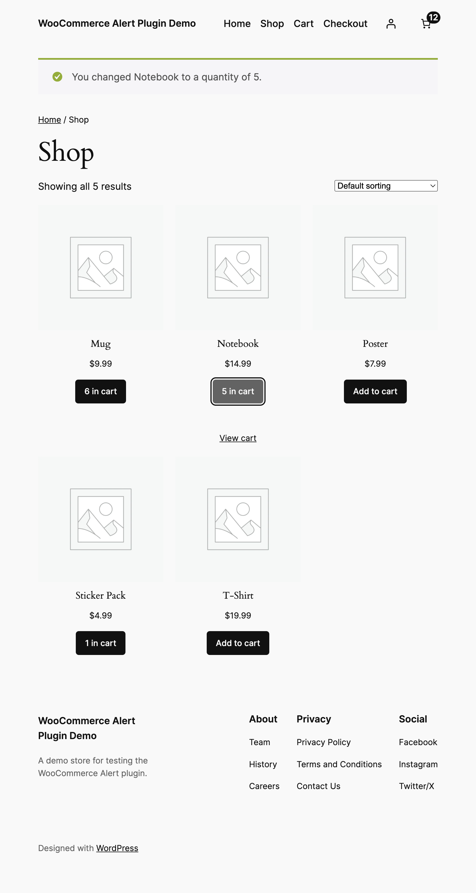
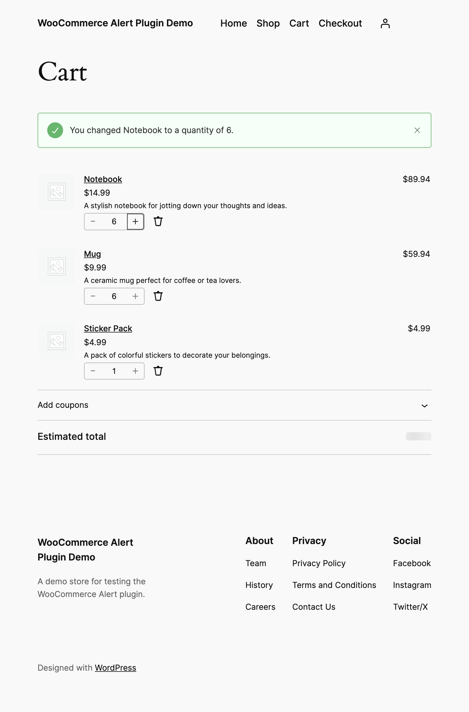

# WC Quantity Alert

A WooCommerce plugin that shows a dismissible success notice when a shopper changes an item's quantity in the Block Cart, and a matching inline alert when the in-cart quantity changes from the Shop page. The notice includes the product name and, when available, the SKU.

## How It Works

1. **Cart tracking** — `WC_Quantity_Tracker` hooks into `woocommerce_after_cart_item_quantity_update` to record each cart quantity change (product name, SKU, new quantity) in the WooCommerce session.
2. **Cart Store API extension** — The plugin extends the Cart Store API endpoint to expose those session-stored changes under the `wc-quantity-alert` namespace.
3. **Cart notice** — A vanilla JS subscriber (`quantity-alert.js`) watches the `wc/store/cart` data store via `wp.data`. When new changes appear in `cartData.extensions['wc-quantity-alert']`, it dispatches a `core/notices` success notice into the `wc/cart` context.
4. **Shop notice** — A lightweight observer (`shop-quantity-alert.js`) watches the Shop page product buttons for `N in cart` changes and shows a matching quantity-change message inline on the page. This path does not use the Store API extension.

Only the latest change is surfaced. Cart-side session data is cleared after it is read back through the Store API extension.

## WooCommerce Hooks Used

The plugin keeps its PHP integration surface intentionally small and uses the narrowest WooCommerce hooks that match the behavior under test.

| Hook | Why this hook was chosen | Why nearby alternatives were not used |
|------|--------------------------|---------------------------------------|
| <code>woocommerce_after_cart_item_<br>quantity_update</code> | It runs after WooCommerce has accepted the new cart quantity and gives the plugin the cart item key plus both the old and new quantities. That makes it easy to ignore no-op updates, read the final product object, and persist the exact quantity that the shopper ended up with. | Broader cart lifecycle hooks such as `woocommerce_cart_updated` fire after many cart changes, not just quantity edits, so they would require extra diffing to figure out what changed. Earlier or lower-level hooks are also a worse fit because this plugin needs the final committed quantity, not an in-progress mutation. |
| <code>woocommerce_blocks_<br>loaded</code> | The Store API extension is only registered once WooCommerce Blocks has loaded its Store API classes and helper functions. This is the safest point to call `woocommerce_store_api_register_endpoint_data()` and reference the cart schema constant. | More generic bootstrap hooks such as `plugins_loaded` or `init` can run before Blocks has finished loading, so the Store API registration function or schema classes may not exist yet. Using those hooks would mean extra defensive branching around a dependency that WooCommerce already exposes with a dedicated readiness hook. |

### Why there is no separate WooCommerce hook for the Shop alert

The Shop-page alert does not come from a dedicated WooCommerce PHP hook. In this implementation, the Shop experience is driven from the browser with `shop-quantity-alert.js`, which observes the product button text changing to `N in cart`.

That tradeoff was deliberate:

- the cart page already exposes a stronger integration point through the Blocks cart data store and Store API extensions
- the shop page in this project does not expose an equivalent state-driven hook for the exact inline alert behavior being demonstrated
- adding more server-side hooks would not remove the need to detect the client-side shop UI change that the user actually sees

For that reason, the plugin uses WooCommerce hooks only where WooCommerce exposes a reliable state boundary, and falls back to a tightly scoped frontend observer on the Shop page.

---

## Architecture

This project is intentionally split into small layers so the WooCommerce integration points stay simple and the UI behavior remains explainable.

### 1. Architecture Layers



```text
+-----------------------+
|  Shopper Interaction  |
+-----------+-----------+
      |
      v
+-----------------------+
| Woo Blocks UI Surface |
| Shop page / Cart page |
+-----+-----------+-----+
    |           |
    |           +---------------------------+
    |                                       |
    v                                       v
+----------------------+        +---------------------------+
| Shop observer JS     |        | Cart subscriber JS        |
| shop-quantity-alert  |        | quantity-alert.js         |
+----------------------+        +-------------+-------------+
                  |
                  v
             +---------------------------+
             | Store API extension       |
             | wc-quantity-alert         |
             +-------------+-------------+
                   |
                   v
             +---------------------------+
             | Woo session state         |
             | wc_qty_changes            |
             +-------------+-------------+
                   |
                   v
             +---------------------------+
             | WooCommerce hook layer    |
             | quantity update events    |
             +---------------------------+
```

### 2. Data Flow Sequence



```text
1. Shopper changes quantity.
2. WooCommerce fires the quantity update hook.
3. WC_Quantity_Tracker stores the latest change in WC session.
4. Cart UI refreshes through the Store API.
5. Store API extension returns wc_qty_changes under:
   extensions['wc-quantity-alert']
6. quantity-alert.js compares the new payload to the last processed payload.
7. If it is a real new change, it renders one success notice.
8. The PHP Store API callback clears the session payload after returning it.
```

### 3. DOM Resilience Strategy

The solution deliberately uses two different resilience strategies because the Shop page and Cart page expose different integration surfaces.

```mermaid
flowchart LR
  subgraph Cart[Cart Page]
    CartSource[Store API extension payload]
    CartState[wp.data select('wc/store/cart')]
    CartNotice[Notice rendering]
    CartSource --> CartState --> CartNotice
  end

  subgraph Shop[Shop Page]
    ShopButton[Woo product button text\n"N in cart"]
    Observer[MutationObserver]
    ShopNotice[Inline notice rendering]
    ShopButton --> Observer --> ShopNotice
  end

  Stable[Preferred: state-driven integration] --> Cart
  Fallback[Fallback: DOM observation when no store is exposed] --> Shop
```

```text
Cart page resilience:
  Store API payload
    -> wp.data cart store
      -> semantic notice rendering

  Why this is resilient:
  - driven by Woo state, not visual text
  - survives layout and markup movement better
  - easy to dedupe and reason about

Shop page resilience:
  product button text: "N in cart"
    -> MutationObserver
      -> inline notice

  Why this exists:
  - the Shop page in this implementation does not expose the same wp.data cart store integration used on the cart page
  - the observer is isolated to the product-button surface
  - failure radius is limited to shop-page alerts only
```

---

## Prerequisites

| Tool | Version | Notes |
|------|---------|-------|
| Node.js | 18+ | Required by `@wordpress/env` and local Playwright runs |
| npm | bundled with your Node.js install | Used to install project dependencies and run scripts |
| Docker Desktop | current | `@wordpress/env` uses Docker to run WordPress locally |

`WP-CLI` is not required on the host machine for this project. The setup commands run it inside the `wp-env` CLI container.

---

## Local Setup
```bash
# 1. Install dependencies
npm install

# 2. Start the WordPress + WooCommerce environment
npx wp-env start

# 3. Run the storefront setup (theme, pages, navigation, settings)
npx wp-env run cli bash wp-content/scripts/setup-storefront.sh

# 4. Seed demo products (3 with SKU, 2 without)
npx wp-env run cli bash wp-content/scripts/seed-products.sh
```

---

## Access Links

| Page | URL |
|------|-----|
| Home | http://localhost:8888/ |
| Shop | http://localhost:8888/shop/ |
| Cart | http://localhost:8888/cart/ |
| Admin | http://localhost:8888/wp-admin/ |

**Admin credentials:** `admin` / `password`

---

## Screenshots

### Shop Alert



### Cart Alert



---

## Demo Walkthrough

1. Open the **Shop** page at http://localhost:8888/shop/.
2. Add any product to the cart from the Shop page.
3. Click the same product again so its Shop button changes from *Add to cart* to `N in cart`, and confirm the Shop page shows a quantity-change alert.
4. Navigate to the **Cart** page at http://localhost:8888/cart/.
5. Change a product's quantity using the quantity input field — increase or decrease it.
6. Click outside the input or press Tab to trigger the update.
7. A green success notice appears at the top of the cart:
   - **With SKU:** `You changed T-Shirt (SKU: TSHIRT001) to a quantity of 3.`
   - **Without SKU:** `You changed Notebook to a quantity of 2.`
8. The notice is dismissible — click the × to close it.
9. Refresh the page — no notice appears (changes are cleared from the session after being read).

---

## Running E2E Tests

Tests use [Playwright](https://playwright.dev/) and run against the local environment at `http://localhost:8888`. Make sure `wp-env start` is running and the store has been seeded before running them.

The current automated suite covers the cart alert flow. The shop-page alert flow is currently validated manually.

### Install Playwright browsers

```bash
npx playwright install chromium
```

### Run all tests

```bash
npx playwright test --config=tests/e2e/playwright.config.ts
```

Equivalent npm script:

```bash
npm test
```

### Run a specific test file

```bash
npx playwright test tests/e2e/cart-quantity-alert.spec.ts --config=tests/e2e/playwright.config.ts
```

Equivalent npm script:

```bash
npm run test:e2e
```

### Run tests with a visible browser (headed mode)

```bash
npx playwright test --config=tests/e2e/playwright.config.ts --headed
```

### Test coverage

| Test | Description |
|------|-------------|
| `no alert on page load` | Cart loads without showing any notice |
| `no alert on page refresh` | Refreshing the cart does not re-show previous notices |
| `alert on quantity change - Product with SKU` | Notice includes product name and SKU |
| `alert on quantity change - Product without SKU` | Notice includes only the product name |
| `no alert when quantity unchanged` | Setting the same quantity does not trigger a notice |
| `latest change replaces prior cart alert` | Only the most recent cart quantity change remains visible |

---

## Project Structure

```
plugins/
  wc-quantity-alert/
    wc-quantity-alert.php          # Plugin entry point
    includes/
      class-quantity-tracker.php   # Server-side hooks and Store API extension
    assets/
      quantity-alert.js            # Client-side cart subscriber
      shop-quantity-alert.js       # Shop-page quantity alert observer
scripts/
  setup-storefront.sh              # One-time storefront configuration
  seed-products.sh                 # Sample product seeder
tests/
  e2e/
    cart-quantity-alert.spec.ts    # Playwright E2E tests
    playwright.config.ts           # Playwright configuration
```
